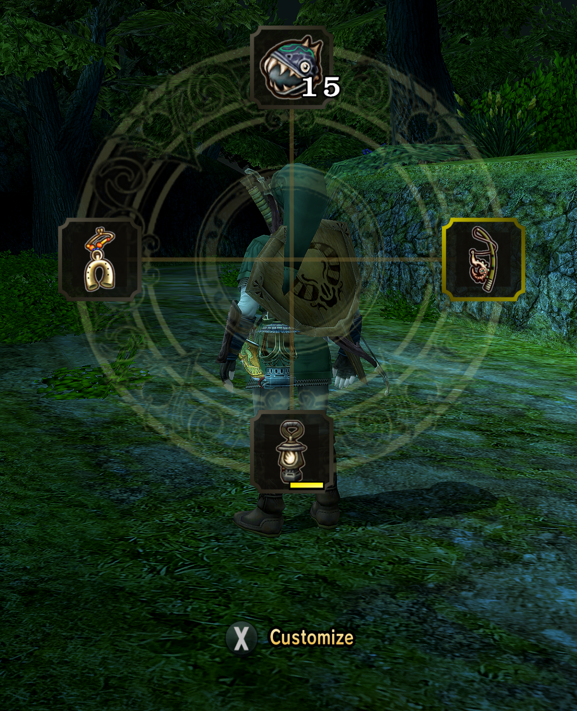
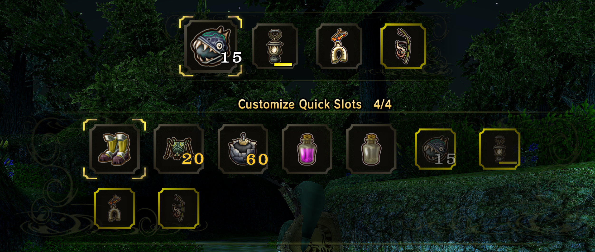
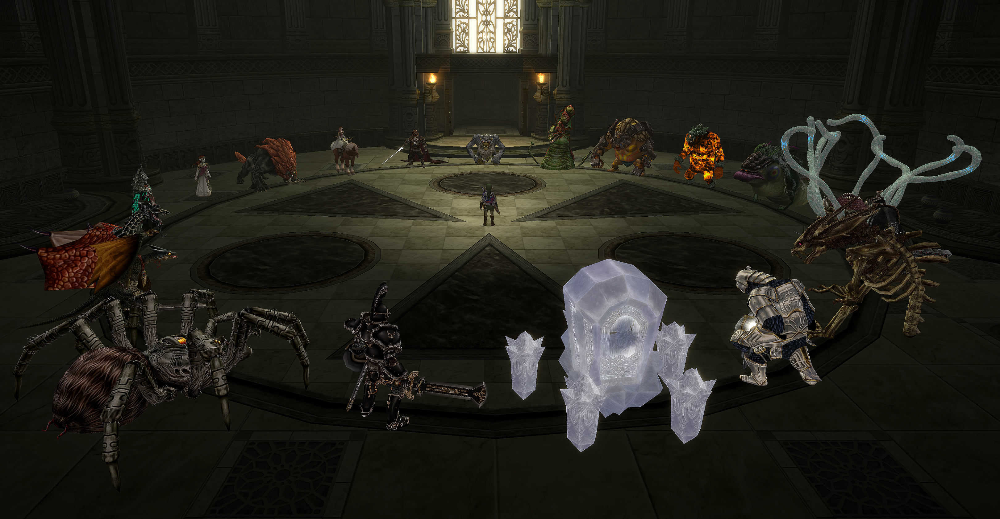

# Twilit Essentials (v2.1.1)

A collection of quality-of-life improvements, combat tweaks, and visual enhancements for *The Legend of Zelda: Twilight Princess* on the [Dusklight](https://github.com/TwilitRealm/dusklight) engine.

## Features

### Enemy Health Bars & Damage Numbers
* Shows a health bar above nearby enemies.
* Shows floating damage numbers when you hit an enemy.
* Ghost enemies like Poes only show up while you are using Wolf Senses.
* Optional: show the enemy's exact HP numbers on the bar.

  

### Boss Health Bars
* Shows a big health bar with the boss's name at the top of the screen during boss and miniboss fights.
* Works for every boss in the game, including fights with multiple phases.

### Visible Equipment
* Shows the Bow, Quiver, and Lantern on Link's model.
* Option to show gear only while it is assigned to X/Y/Z, or always once you own it.
* Individual toggles and mirror options for equipment placement.

  
  

### Custom Z Button & D-Pad Midna Call
* Adds a third item slot on the Z button.
* The HUD icon shows the item and its ammo or oil counter.
* Moves Midna's call to D-Pad Left.

  

### Quick Access
* Tap D-Pad Down to use the item in the Down slot right away.
* Hold D-Pad Down to open a small item menu with your Horse Call, Iron Boots, Lantern and more.
* Two styles: Radial (like the normal item wheel) or Item Bar (a horizontal bar at the top of the screen, like in Breath of the Wild).
* Press X while the menu is open to choose which items it holds.
* As a wolf, holding D-Pad Down opens the Sun Song menu to switch between day and night.

  

  

### Bottle Quick Access (L)
* Shows your four bottles in their own menu on the L button.
* Tap L to use the bottle on L. Hold L to open the menu, then release to use the bottle you picked.
* Note: while this is on, L no longer triggers targeting and shield.
* If "Hide items from item wheel" is on, your bottles are hidden from the normal item wheel as well.

### Collection Menu Enhancements
* Adds extra equipment slots for the Wooden Sword and Ordon Clothes in the Collection screen.
* Option to unequip swords and shields by selecting them again.
* Option to keep the Ordon Shield in the Collection even after it burnt. If this is turned off, you will always find an Ordon Shield in the treasure chest in Link's House. It comes back there whenever it breaks.
* With the starter gear option on, you can also buy an Ordon Shield in Sera's shop for 150 rupees.
* A second page holds the Heart Containers and the Fused Shadow. Switch pages with L and R.
* **Custom textures**: drop a PNG into `<Dusklight data folder>/texture_replacements/` to override the
  mod's collection icons — `ordon_clothes.png` for the Ordon Clothes, `ordon_clothes_linkle.png` for the
  Linkle variant. Both should have 768x768 as resolution.

  

### Sheathed Spin Attack
* Perform spin attacks directly with a sheathed sword.

### Puppet Zelda Fixed Pattern
* Removes the randomness from Puppet Zelda's attacks. She always follows the same 7-step pattern.
* Option to always force her shortest attack (Sword Dive).

### Stamina System
* Adds a stamina meter for attacks, rolls, climbing, swimming, pushing and pulling, and the wolf dash.
* The meter refills on its own while you rest. When it runs out, Link moves slower for a moment.
* Every activity can be turned on or off, and every cost can be changed.
* Adds three new sprint moves. Hold the roll button to use them:
  * **Human sprint** — run faster for a while.
  * **Wolf sprint** — keep running at dash speed as a wolf.
  * **Swim sprint** — swim faster. Does not work with the Zora tunic.

### Boss Rush
* Fight every boss in the game on demand. The "Start Boss Rush" setting takes you to a room with a statue for every boss.
* Press A in front of a statue to jump straight into that fight. Intro cutscenes are skipped, and you return to the room automatically afterwards.
* Cutscenes in between boss phases are completely removed (Diababa, Morpheel, Blizzeta, Stallord, Argorok).
* **Master Rush:** press A at the Master Sword in the middle of the room to fight every boss in a row. Your hearts carry over from fight to fight, and the timer saves your best time for the whole run.
* Press D-Pad Right to restart a fight at any time.
* A built-in timer measures each fight and saves your personal best for every boss.
* Optional helpers: the right items for each boss, a refill after every fight, a map portal (press Z on the map screen), and a mode that limits your gear to what you would normally have.
* Note: you can reach every boss this way, even ones you have not met in the story yet. Spoilers ahead!

  

### Quality of Life
* **Skip Cutscenes** — skips all skippable cutscenes automatically.
* **Fast-Forward Cutscenes** — plays cutscenes and boss intros that cannot be skipped at 4x speed.
* **Fast Scene Transitions** — makes room, door and map transitions faster.
* **Warp as Human** — human Link warps with the light beam instead of turning into a wolf first.
* **Faster Midna Cancel** — allows you to cancel Midna faster.
* **Horse Camera** — on Epona, the camera stays where you point it instead of drifting back behind Link.
* **No Letterbox While Lock-On** — no black bars on the screen while you lock onto an enemy.
* **Drowning Warning** — the screen edges pulse blue while your air runs low.
* **Damage Vignette** — the screen edges flash red when you take damage, and pulse at low health.

### HUD Auto-Fade
* Fades the whole HUD (hearts, items, gauges, minimap) out softly while Link stands still.
* The HUD comes back the moment he moves.
* Menus, cutscenes and dialogues always show the HUD normally.

### Bug Fixes (always active)

### Mod Settings
Every feature can be turned on or off in real time in the in-game menu. A "Twilit Essentials" tab opens a settings window where every option comes with its own explanation.

## Installation

1. Download `twilit_essentials.dusk` from [Releases](https://github.com/F1mmel/dusklight-twilit-essentials/releases).
2. Place the file in your Dusklight mods folder:
   * **Windows:** `%APPDATA%\TwilitRealm\Dusklight\mods`
   * **Linux:** `~/.local/share/TwilitRealm/Dusklight/mods`
   * **macOS:** `~/Library/Application Support/TwilitRealm/Dusklight/mods`
3. Enable the mod in the in-game Mod Manager menu.

---

## Credits

* The Ordon Hero models are included with kind permission from SkilarBabcock. Thank you!

---

## AI Disclaimer

This mod was created in part with the help of AI. AI tools were used for **research** purposes — analyzing the game engine and gathering technical background information that informed the implementation.
