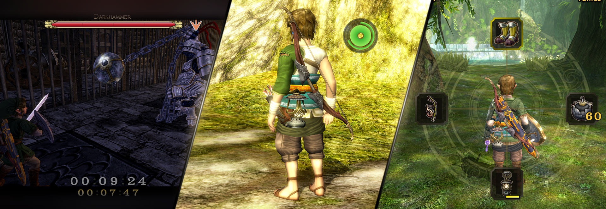
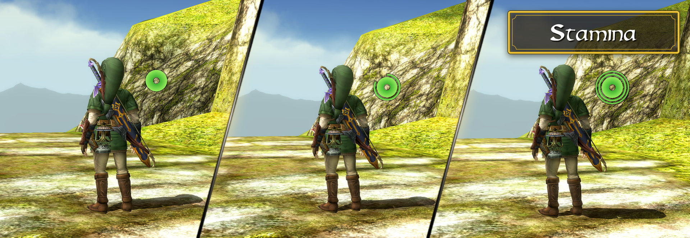
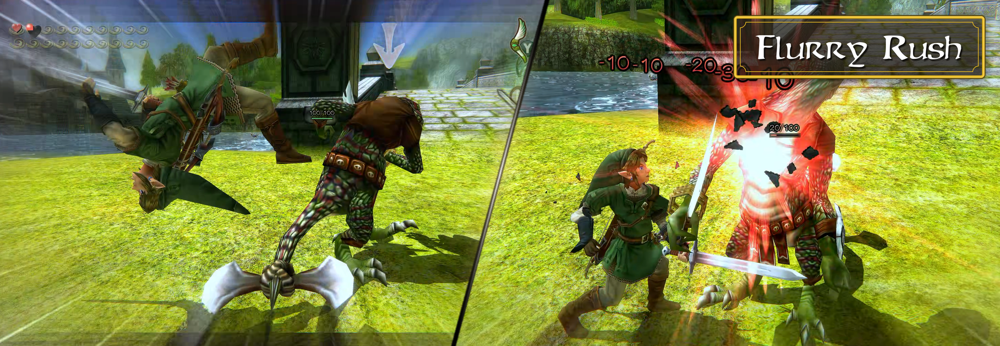
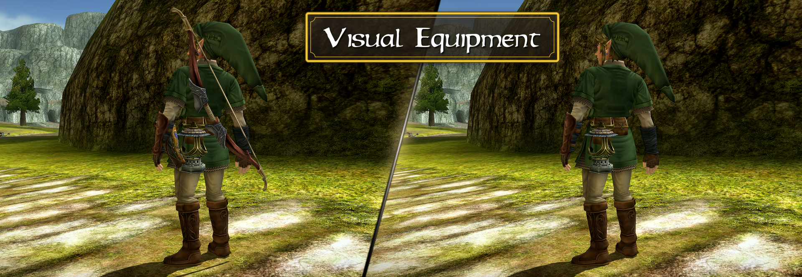
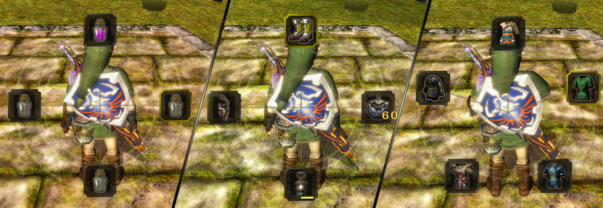
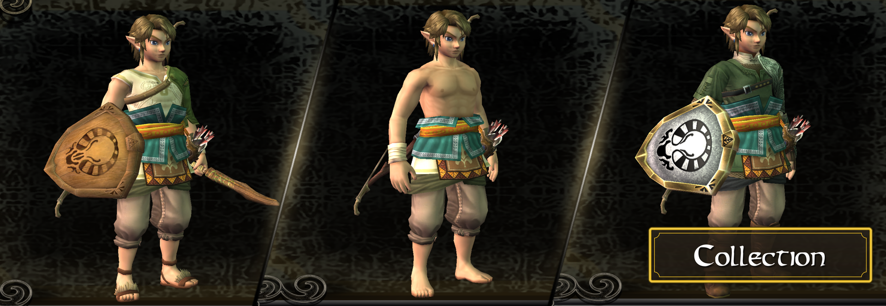
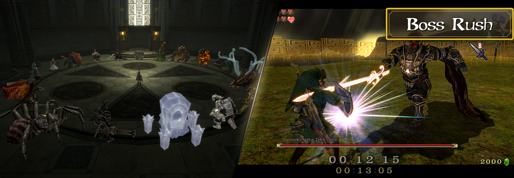

# Twilit Essentials (v2.4.2)

A collection of quality-of-life improvements, combat tweaks, and visual enhancements for *The Legend of Zelda: Twilight Princess* on the [Dusklight](https://github.com/TwilitRealm/dusklight) engine.

  

## Features

The in-game settings window is organized into tabs.

### General
* **Skip Cutscenes** — skips all skippable cutscenes automatically.
* **Fast-Forward Cutscenes** — plays unskippable cutscenes at increased speed. "Skip even more" also covers doors, chests and similar waits.
* **Fast Scene Transitions** — makes room, door and map transitions faster.
* **Horse Camera** — on Epona, the camera stays where you point it instead of drifting back behind Link.
* **HUD Auto-Fade** — fades the whole HUD out softly while Link stands still, and back in the moment he moves.
* **Remove Enemy Combat Music** — enemies no longer switch the music to the battle theme.
* **Damage Vignette** — the screen edges flash red when you take damage, and pulse at low health.
* **Drowning Warning** — the screen edges pulse blue while your air runs low.
* **Free Camera** — adjustable camera distance, optionally also while Z-targeting.

### Quality of Life
* **Warp as Human** — human Link warps with the light beam instead of turning into a wolf first.
* **Custom Z Button & Midna Call** — adds a third item slot on the Z button. Midna's call moves to D-Pad Left. The Midna button is remappable.
* **Faster Midna Cancel** — allows you to cancel Midna's call faster.
* **Epona Tweaks** — turn speed and top speed sliders, unlimited spurs, and auto-gallop.
* **Stamina System** — adds a stamina meter for attacks, rolls, climbing, swimming and more. Running out exhausts Link briefly. Every activity and cost is configurable.
  * **Human sprint** — run faster, with long-distance jumps.
  * **Wolf sprint** — keep running at dash speed as a wolf.
  * **Swim sprint** — swim faster.
  * **Swimming stamina** — swimming and diving cost stamina unless you wear the Zora Armor; floating still slowly recovers it, and running out makes Link drown.
  

  

### Combat
* **Enemy Health Bars & Damage Numbers** — health bars above nearby enemies and floating damage numbers when you hit. Optional exact HP numbers. Poes only show up while using Wolf Senses.
* **Boss Health Bars** — a big health bar with the boss's name at the top of the screen during boss and miniboss fights. Works for every boss, with several styles to choose from.
* **Sheathed Spin Attack** — perform spin attacks directly with a sheathed sword.
* **Flurry Rush** — dodge an attack with perfect timing to slow down time and land a rapid flurry of hits, like in Breath of the Wild.
* **Bullet Time** — aim the bow in mid-air to slow down time while Link and his arrows keep full speed, like in Breath of the Wild. Drains stamina and ends when you land or run out of stamina.
* **Puppet Zelda Fixed Pattern** — removes the randomness from Puppet Zelda's attacks: she always follows the same 7-step pattern.

  

### Visuals
* **Visual Equipment** — shows the Bow, Quiver, and Lantern on Link's model, with toggles and placement options.

  

### Quick Access
* **Quick Access** — tap the button to use the item in the Down slot right away, hold it to open a small item menu with your bottles, Two styles: Radial or Item Bar (BotW-style). Customize its items with X. As a wolf, holding the button opens the Sun Song menu.
* Pages can be cycled with L (previous page) and R (next page)

  

### Menus
* **Collection Menu Enhancements** — extra equipment slots for the Wooden Sword and Ordon Clothes, unequip swords, shields and tunics (without a tunic, Link wears his sumo outfit) and a second page with the Heart Containers and the Fused Shadow. Detects the Linkle mod automatically and changes certain things like Ordon Clothe texture.
* **Custom textures**: drop a PNG into `<Dusklight data folder>/texture_replacements/` to override the mod's collection icons.
  * Ordon Clothes: `<Dusklight data folder>/texture_replacements/ordon_clothes.png`
  * Linkle Clothes: `<Dusklight data folder>/texture_replacements/ordon_clothes_linkle.png`

  

### Boss Rush
* Fight every boss in the game on demand - directly as a game mode on the title screen.
* Intro and phase cutscenes are skipped or completely removed, and you return to the room automatically afterwards.
* **Master Rush:** fight every boss in a row via the Master Sword in the middle. Hearts carry over, with configurable retry mode and two difficulties (Normal / Hard with 3 hearts).
* A built-in timer saves your personal best for every boss, and for full runs. D-Pad Right restarts a fight at any time.
* Optional helpers: a refill after every fight, a map portal (or Quick Access button), and a mode that limits your gear to what you would normally have.
* **Dark Link** (experimental): adds a Dark Link statue after Ganondorf when the Dark Link mod is installed.
* Note: you can reach every boss this way, even ones you have not met in the story yet. Spoilers ahead!

  

### Controls
* Remap the mod's buttons: Quick Access, Bottle Quick Access, Sprint and the Z button.

### Customization
* X/Y offsets for the Stamina Bar, the Boss Bar and the Boss Rush Timer.
* **Stamina Bar style** — Default (Twilight Princess lantern-style bar in the HUD) or **BotW Wheel**: a Breath of the Wild stamina wheel floating next to Link. Extra stamina is shown as up to two smaller rings around it, which grow with max stamina scaling.
* **Boss Bar style** — choose between several boss bar designs.

### Mod Settings
Every feature can be turned on or off in real time in the in-game menu, with its own explanation. On mobile builds, the mod is fully touch-compatible.

---

## Compatibility

* Works with the TP HD HUD mod and with Olivia's Extra Buttons.
* Not fully compatible with the Randomizer.

---

## Credits

* The Ordon Hero models are included with kind permission from SkilarBabcock. Thank you!

---

## AI Disclaimer

This mod is not "vibe coded". The vast majority of the code — the architecture, every feature and its implementation — was written by myself. I know where everything lives in this codebase, I know what the code does, and every feature that ships has been understood, tested and refined by me.

AI tools were used only as a **research aid** in a few places: gathering background information about the game engine faster than manual digging would have allowed. The two biggest examples are the third item slot and the custom Collection screen slots — systems that are genuinely weird, where I was stuck for multiple days before getting help on the research side. The actual implementation was and is my own work.

Unlike the code, the **texts and markdown files** (like this README) were written with AI assistance.
